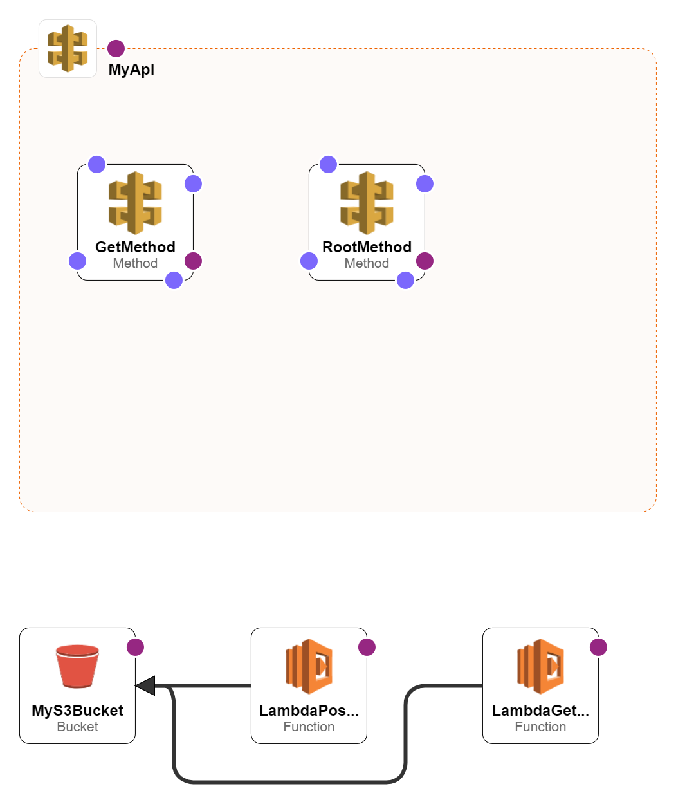

# Mein AWS LAMBDA-HTTP-API STACK

## Architektur

## Lambda Funktionen
- `lambda-get`: Liest eine Datei aus dem S3-Bucket.
- `lambda-post`: Speichert eine Nachricht im S3-Bucket.

## CloudFormation
Die Vorlage befindet sich in der Datei `cloudformation-template.yaml`.
